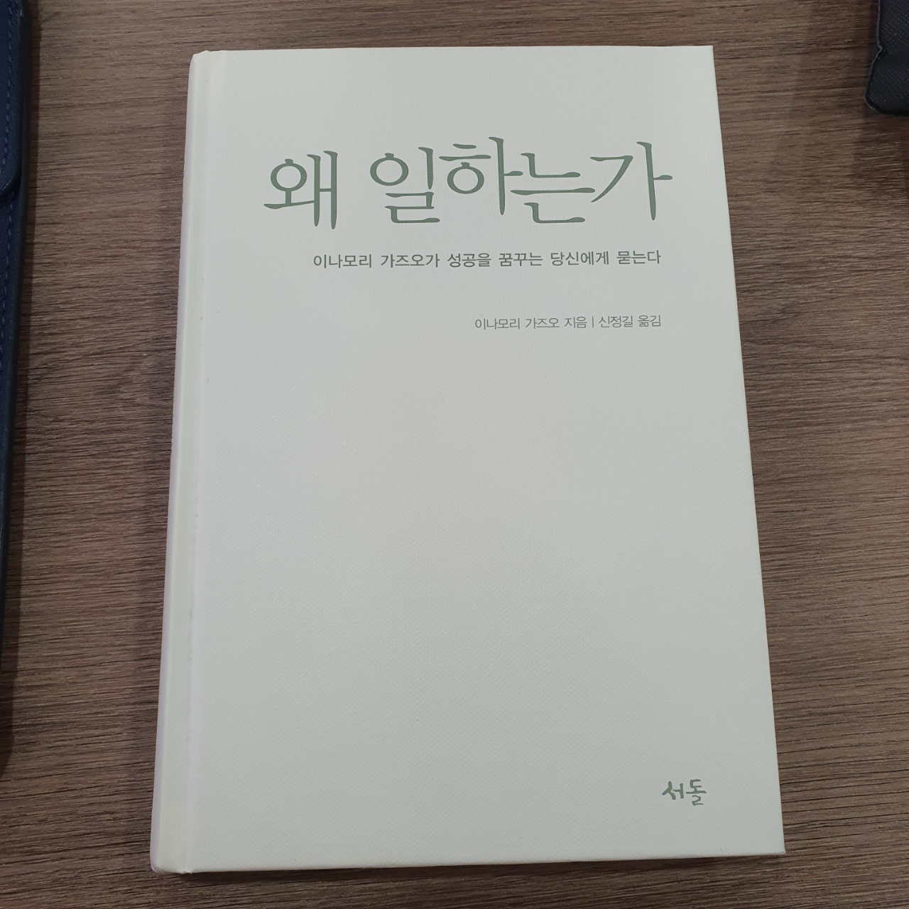

 자주 글을 쓰겠다고 다짐했지만 생각만큼 열심히 쓰지 않고 있다. 
 오랜만에 독서를 일고 글을 남긴다. 이재후 팀장님께서 "왜 일하는가"
 교세라의 창업주 이나모리 가즈오의 책을 선물해 주셨다. 

  처음 글을 읽으면서 드는 생각은 역시나 최선을, 역시나 완벽을 
기업가의 입장에서 직원들에게 노력할 것을 바라는 경영자의 마인드라는 비관적인 생각이 들었다. 
하지만 맞는 말이다. 열심히 하지 않으면 애초에 성공이란걸 할 수 없다. 
결과는 과정이 있기에 생기는 것이다. 아무것도 없이 발생할 수는 없다. 
살면서 정말 달콤했던 말이 3달만에, 3주만에, 3시간만에, 30분만에 다이어트, 영어대화
기타 등등 이러한 말들이 너무 좋았다. 조금만 하면 할 수 있는 방법이 있는데
왜 미련하게 반복하고 또 반복하는가 그렇게 극한의 효율충이 되었다. 

 하지만, 20대 후반을 살면서 느끼는 게 단기간에 이룩한 것은 그만큼 볼품이 없고
 누구나 할 수 있고 허상에 불과하다는 것이다. 진짜 이룩하고 성공하고 무언가 해본 사람은
 겸손하다. 그리고 굳이 나서서 저런걸 반박하지 않는다. 왜냐하면 하나도 겁나지 않기 때문이다. 
 단기간에 성과를 자랑하는 사람은 어차피 조용해 질거라는 걸 너무나도 잘 알기 때문에
 여유롭다. 진짜 고마운 사람은 그런 허상에 젖은 사람에게 쓴소리를 해주는 사람이다. 
 왜냐하면 단기간에 성과를 이룩한 사람은 자신의 성과를 침해 받는걸 극도로 혐오해서
 니가 뭘아냐면서 오히려 상대방의 쓴소리에 상대방을 비하한다. 괜히 병머금이라는 말이 있는게 
 아닌 것 같다. 

 